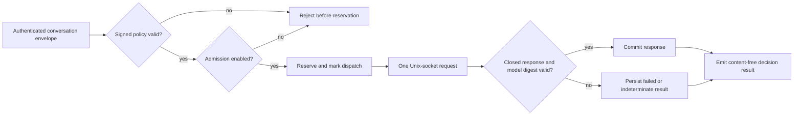

# Self-hosted restricted inference runtime

**Status:** executable for product slice 1; operator PHI authorization is a
separately signed external authority  
**Intake:** brownfield  
**Owner:** deployment operator  
**Version:** 1.0

## 1. Executive summary

This design adds a provider-neutral, self-hosted profile without weakening the
existing frozen Vertex synthetic profile. The self-hosted profile reaches one
operator-controlled inference broker exclusively through a Unix domain socket,
uses one signed model identity, and retains the existing text-only, one-attempt,
no-tools, no-fallback contract.

The product can prove bounded protocol and policy properties. It cannot declare
a deployment HIPAA compliant. `OPERATOR_PHI_AUTHORIZED` is an external decision
based on the operator's risk analysis, workforce controls, physical and
infrastructure safeguards, retention policy, and any agreements with
infrastructure providers. The runtime only consumes a narrowly bound,
offline-signed operator authorization artifact after that decision.

## 2. Objective contract

- **Actor:** an operator deploying Hermes inside a boundary the operator owns.
- **Trigger:** the operator selects the signed `local-uds` inference profile.
- **Desired outcome:** the restricted gateway can perform one bounded text
  inference without any provider-network path in the application client.
- **Scope:** signed closed policy; local Unix-socket inference protocol; signed
  operator execution authority; declared model digest agreement; separate local
  gateway and conversation composition roots; local file-backed MAC and content
  wrapping adapters; bounded, non-attesting protocol-probe receipt constructor;
  executable positive and negative tests.
- **Non-goals:** claiming HIPAA compliance; operating a model server; proving
  host/network/physical controls; Matrix; multi-tenancy; tools, plugins, MCP,
  skills, memory, compression, attachments, OCR, vision, streaming, fallback,
  model selection by callers, or migrating the existing Vertex policy.
- **Success criteria:** all existing Vertex behavior remains green; no TCP URL
  is accepted by the local profile; the only local dispatch uses the signed
  Unix socket and exact closed wire contract; malformed, partial, mismatched,
  timed-out, or unavailable inference fails closed; a content-free receipt
  distinguishes product conformance from external authorization.
- **Failure criteria:** a caller can select a sink/model; environment proxies
  affect inference dispatch; the local inference path opens an INET socket; a response with a different
  model digest is accepted; `admission=true` can dispatch without a valid
  operator authorization; product evidence claims model attestation, deployment
  conformance, HIPAA compliance, or PHI authorization.
- **Stopping condition:** slice 1 tests and static guards pass on the exact head,
  and no confirmed adversarial closure-falsifier remains.
- **Autonomy:** bounded action.

## 3. Authority and trust boundaries

| Boundary | Authority and rule |
|---|---|
| Caller -> conversation | Caller supplies content and idempotency identity only; it cannot select policy, provider, model, socket, retention, or classification. |
| Conversation -> gateway | Existing authenticated envelope, signed policy epoch/digest, tenant, and PHI classification remain authoritative. |
| Gateway -> local broker | One non-streaming request over an operator-mounted Unix socket. No TCP fallback exists. The operator owns the socket namespace; the client does not claim peer or model attestation. |
| Broker/model | Untrusted. Runtime validation detects disagreement with the signed declared digest, not dishonesty by a compromised broker. |
| Runtime -> local keys | Active and retired key material is mounted read-only beneath `/run/restricted-keys/`; no Google KMS or cloud credential is required by a local composition root. |
| Product -> operator | Product emits bounded conformance evidence. The operator owns deployment authorization and all infrastructure, administrative, and physical evidence. |

## 4. Policy contracts

The existing `restricted-phi-inference-policy.v1` Vertex schema remains byte-
and behavior-compatible. A second schema is added:

```yaml
schema_version: restricted-self-hosted-inference-policy.v1
authorization_status: operator-authorization-required
provider: local-uds
socket_path: /run/restricted-inference/broker.sock
method: restrictedGenerate
model: operator-chosen-display-name
model_sha256: <64 lowercase hex characters>
response_profile: restricted-local-text-response.v1
streaming: false
fallbacks: []
max_provider_attempts: 1
allowed_modalities: [text]
tools_allowed: false
```

The schema also carries the existing principal, tenant, policy epoch, system
instruction, size, and generation bounds. The socket path must be absolute,
normalized, below `/run/restricted-inference/`, and end in `.sock`. The policy
does not contain a URL, host, port, credential, proxy, or operator compliance
claim. Vertex and local schemas have disjoint exact field sets and validators;
neither accepts fields belonging only to the other schema.

Every policy class exposes an exact `sink_tuple()` used by durable reservation
and replay comparison. The Vertex tuple remains unchanged. The local tuple
includes schema, provider, socket path, method, model display name, declared
model SHA-256, and response profile. Changing any element under an existing
turn identity is a replay conflict before dispatch.

## 5. Operator execution authority

The local production composition root requires an independently signed
`restricted-operator-authorization.v1` artifact. It binds:

- policy epoch and digest;
- tenant identifier;
- provider `local-uds`;
- declared model SHA-256;
- purpose-labeled gateway and conversation keyset digests;
- a non-empty permitted-use identifier;
- issue and expiry instants.

The signing key is operator-owned and is never generated or stored by the
product. A missing, expired, malformed, cross-policy, cross-tenant, or invalidly
signed artifact prevents startup. `RESTRICTED_ADMISSION_ENABLED=true` remains a
kill-switch input but cannot grant authority: dispatch requires both a valid
operator artifact and enabled admission. Tests and protocol probes use direct
test composition and cannot instantiate the production local composition root
as authorized.

Authorization expiry is checked again before conversation mutations and
reconciliation scans, before every gateway reservation, and immediately before
the durable dispatch transition. A service that remains alive past `expires_at`
rejects the next operation without broker dispatch. These are request-boundary
checks, not a claim of continuous-time or trusted-clock enforcement. Early
revocation is implemented by the existing admission kill switch; online
revocation lists are out of scope.

## 6. Local broker wire contract

The client sends one literal HTTP/1.0 close-delimited request as framing over a
Unix socket and posts to `/v1/restricted/generate`. The response parser accepts
only an HTTP/1.1 status line plus exact `Content-Type` and `Content-Length`
headers; the UDS service launcher disables Uvicorn's optional `Date` and
`Server` headers. The client follows no redirects, performs no retry, ignores
proxy environment variables, imposes bounded connect/read/write and total
deadlines, caps the response at 1 MiB, and sends one candidate.

Request:

```json
{
  "schema_version": "restricted-local-inference-request.v1",
  "system_instruction": "<fixed product instruction>",
  "messages": [{"role": "user", "text": "..."}],
  "generation_config": {"candidate_count": 1, "max_output_tokens": 4096},
  "declared_model_sha256": "<signed digest>"
}
```

Response:

```json
{
  "schema_version": "restricted-local-inference-response.v1",
  "state": "SUCCEEDED",
  "finish_reason": "STOP",
  "text": "...",
  "model_sha256": "<same signed digest>",
  "request_id": "<non-empty broker identifier>"
}
```

Every field is required and unknown fields are rejected. Non-200 responses are
`FAILED`; malformed, oversized, partial, transport-ambiguous, or digest-mismatch
responses are `INDETERMINATE`. Neither class triggers another attempt. Digest
agreement is recorded as `broker_declared_model_sha256`; it is not evidence of
the artifact actually loaded by the broker.

The self-hosted process topology uses three distinct Unix sockets:

```text
operator client -> conversation.sock
conversation    -> gateway.sock
gateway         -> broker.sock
```

The conversation image cannot import or construct `Gateway`, `PostgresLedger`,
`LocalUdsClient`, or any provider client. It uses a closed local gateway client
for real infer/status/fence/readiness calls; none may return a synthetic constant.
The existing reconciliation driver uses those calls exactly as the cloud root
does. The gateway image owns the ledger and the sole broker client. Both service
images expose their application servers through UDS only, create those sockets
with restrictive modes, expose no TCP port, and use the socket-permission trust
boundary instead of Google OIDC or bearer tokens. This does not claim that the
PostgreSQL client is unable to use TCP; the operator owns and must authorize the
configured database endpoint.

Conversation `/readyz` returns one closed, policy-derived document: the exact
policy epoch/digest and the approved text-only capability fields. Unknown or
missing fields are a contract failure for local preflight. It is not a
deployment, model-attestation, or PHI-authorization assertion; those claims
remain local constant `false` values in protocol receipts.

The shared socket namespace has an explicit numeric ACL contract. Its directory
is `root:20000` with mode `1770`. `conversation.sock` is group `20001`,
`gateway.sock` is group `20002`, and the operator-managed `broker.sock` is group
`20003`; all sockets are mode `0660`. The conversation image runs as UID `10006`,
primary GID `20001`, with supplementary GIDs `20000,20002`. The gateway image
runs as UID `10005`, primary GID `20002`, with supplementary GIDs `20000,20003`.
An external client must receive only directory traversal plus GID `20001`; the
broker must receive directory traversal plus GID `20003`. The operator must
preserve these numeric owners and modes on the shared runtime mount. This keeps
external callers from invoking the internal gateway socket while allowing the
two intended service hops.

## 7. Harness and graph



The runtime contains no model-driven policy decision. The model only generates
text after deterministic admission. There are no loops: attempts are fixed at
one and retries are prohibited.

## 8. State, logging, and receipts

Existing encrypted request/response persistence and durable attempt states are
unchanged. The local client must not log content, system instructions, raw
responses, authorization headers, or socket request bodies.

The product-generated protocol-probe receipt contains only:

- receipt schema and generation timestamp;
- source revision reported by the build or collector, explicitly labeled as an
  unverified claim unless an external deployment collector binds it to an image;
- policy epoch and digest;
- provider and response-profile identifiers;
- broker-declared model SHA-256 agreement;
- normalized socket path;
- synthetic probe terminal class and broker request ID digest;
- fixed `external_controls_verified: false`;
- fixed `deployment_conformant: false`;
- fixed `model_attested: false`;
- fixed `phi_authorized: false`.

No product command can change those four fields to true. The constructor is a
content-free diagnostic record, not an attestation that a dispatch occurred;
its source revision is an explicitly unverified, closed identifier and external
evidence must bind it to a real harness run. An operator may compose this receipt
with independently collected image, model, host, and network evidence outside
the product.

### Local cryptographic adapters

The self-hosted profile must not retain a Google KMS runtime dependency. Its
gateway and conversation roots use separate local key adapters implementing the
existing MAC and data-key-wrapper protocols.

Key material rules:

- absolute normalized regular files only beneath `/run/restricted-keys/`;
- no symbolic links; open with no-follow semantics and verify the opened inode;
- owner is root or the runtime UID, with no group/world permission bits;
- exact 32-byte binary keys; no key material in environment variables, images,
  logs, receipts, policy files, authorization artifacts, or command arguments;
- active keys may sign/wrap; retired keys are verify/unwrap only;
- duplicate resource/version or key identifiers are rejected;
- every key reference includes a non-secret SHA-256 fingerprint; key bytes are
  read and verified once at construction, then retained by the adapter so path
  replacement cannot silently change material within a live process;
- operator authorization signs keyset digests whose individual entries are
  purpose-labeled (`gateway-mac`, `service-mac`, `content-wrap`), preventing a
  different active/retired or cross-purpose mapping from being paired with the
  same authorization artifact;
- the content-wrapped-key envelope carries a closed schema and key identifier,
  allowing deterministic selection of an active or retired unwrap key;
- unknown, retired-for-write, malformed, tampered, or unavailable keys fail
  closed without plaintext persistence.

The operator owns key generation, protected backup, rotation, destruction,
access audit, and any HSM integration. File-backed keys make a fully local
deployment possible; they do not claim HSM-equivalent protection.

The product does not claim to defeat rollback of the entire database, policy,
authorization, image, and key filesystem to one mutually consistent historical
snapshot. Preventing that requires an external monotonic deployment/backup
anchor. Within one authorization artifact, a retired key cannot become active
because the signed purpose-labeled keyset digest would change.

## 9. Verification contract

| Case | Expected effect | Required evidence |
|---|---|---|
| Existing Vertex profile | Exact existing request/response and policy behavior remains unchanged. | Existing unit, static, integration and container suites. |
| Cross-schema mutations | A Vertex policy cannot acquire local fields and a local policy cannot acquire Vertex fields. | Executable field-add/remove mutations for both exact schemas. |
| Local normal case | Real Unix-socket fixture receives exactly one closed request and returns one accepted response. | Request capture without PHI, dispatch count, terminal result, receipt. |
| TCP or proxy attempt | Policy/config rejected or no request reaches the TCP control server. | Negative policy tests plus socket-family static/runtime guard. |
| Model mismatch | Response is `INDETERMINATE`; plaintext is not committed as success. | Real Unix-socket mismatch fixture and ledger state assertion. |
| Timeout/partial/malformed/oversized | One attempt; fail closed; no fallback. | Fault-matrix tests and dispatch count. |
| Missing/non-socket path | Composition refuses startup or dispatch before content leaves the process. | Startup and runtime negative tests. |
| Missing/invalid operator authority | Production local composition refuses startup even when admission is enabled. | Signature, expiry, policy, tenant, provider and model binding matrix. |
| Authority expires while live | Next request is rejected before reservation and broker dispatch. | Injected-clock lifecycle test with a valid-at-start artifact. |
| Durable replay | Each schema's exact sink tuple is stored and compared; any sink mutation conflicts before dispatch. | Real PostgreSQL reserve/replay tests for Vertex and local policies. |
| Framing faults | Conflicting length, truncated chunking, trailing bytes and early close never release text. | Raw AF_UNIX HTTP fixtures and exact one-dispatch assertions. |
| Local key files | Symlink, wrong owner/mode/length, inode replacement, duplicate id, unknown retired key and ciphertext tampering fail closed. | POSIX file tests plus MAC and wrap/unwrap rotation matrix. |
| Local images | Neither local gateway nor local conversation image contains/imports `google_kms.py`, `vertex.py`, Google credentials, or cloud composition roots. | Image inspection and import-closure tests. |
| Service separation | Conversation reaches `gateway.sock`, gateway alone reaches `broker.sock`, and neither service binds INET. | Real three-socket E2E plus image import/socket-family inspection. |
| Wrapped-key parser | Oversize, duplicate fields, unknown fields/IDs, invalid base64/length, noncanonical/tampered envelopes fail before key selection or plaintext. | Bounded mutation matrix including pre-parse size cap. |

Passing the product-controlled rows establishes the named protocol and policy
properties for the tested artifact. It does not establish deployment
conformance, host egress isolation, broker image/model attestation, authorized
workforce, retention correctness, incident readiness, HIPAA compliance, or
`OPERATOR_PHI_AUTHORIZED`.

## 10. Implementation slices

1. Add the second closed signed-policy schema without relaxing Vertex v1.
2. Refactor durable sink identity behind exact per-schema `sink_tuple()` methods
   and prove cross-policy replay behavior against PostgreSQL.
3. Add the provider protocol and local Unix-socket client with closed parser.
4. Add and validate the separately signed operator authorization artifact.
5. Add separate UDS-only local gateway and conversation composition roots and
   images plus a closed AF_UNIX gateway client; do not branch
   the existing Vertex composition root using mutable environment configuration.
6. Add POSIX file-backed MAC and content-key wrapping adapters with fingerprinted
   active and retired key support; bind purpose-labeled keyset digests into the
   operator authorization; no local image may contain Google packages.
7. Add the content-free, non-attesting local protocol-probe receipt constructor.
8. Add real Unix-socket E2E and negative fault tests plus static INET-dispatch
   guards; rerun all existing gates.

## 11. Adjudicated residual boundaries

- A compromised local broker can echo the declared model digest. Loaded-model
  attestation is an external deployment responsibility.
- A privileged process controlling the Unix-socket namespace can replace the
  broker. The client rejects symlink/non-socket paths and fails transport errors
  closed, but it does not claim peer identity or eliminate host compromise.
- Broker absence or replacement after startup may yield a durable
  `INDETERMINATE` attempt. Readiness is not authorization and never permits
  retry; existing reconciliation and idempotency rules remain authoritative.
- Process-death behavior at dispatch boundaries must remain covered by the
  existing durable attempt/reconciliation tests and a local-provider variant.

## 12. External operator closure

After product conformance, the operator must separately prove the exact broker
image and model artifacts, network namespace/firewall state, the configured
PostgreSQL endpoint and transport, storage and backup controls, host hardening,
identity and workforce authorization, audit review, retention/deletion,
incident response, and applicable infrastructure-provider agreements. Those
artifacts may be referenced by an operator authorization record, but they are
never manufactured or endorsed by this product.
